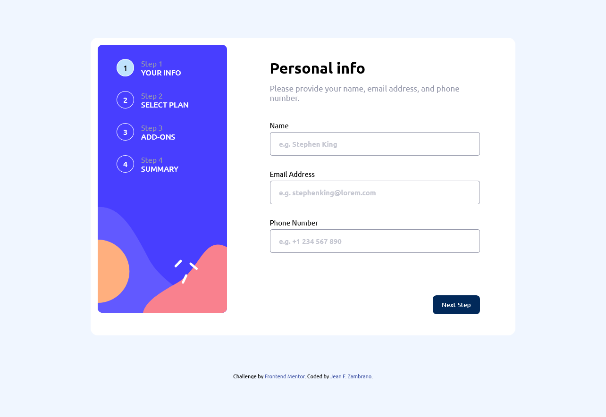

# Frontend Mentor - Multi-step form solution

This is a solution to the [Multi-step form challenge on Frontend Mentor](https://www.frontendmentor.io/challenges/multistep-form-YVAnSdqQBJ). Frontend Mentor challenges help you improve your coding skills by building realistic projects.

## Table of contents

- [Overview](#overview)
  - [The challenge](#the-challenge)
  - [Screenshot](#screenshot)
  - [Links](#links)
- [My process](#my-process)
  - [Built with](#built-with)
  - [What I learned](#what-i-learned)
  - [Continued development](#continued-development)
  - [Useful resources](#useful-resources)
- [Author](#author)

**Note: Delete this note and update the table of contents based on what sections you keep.**

## Overview

### The challenge

Users should be able to:

- Complete each step of the sequence
- Go back to a previous step to update their selections
- See a summary of their selections on the final step and confirm their order
- View the optimal layout for the interface depending on their device's screen size
- See hover and focus states for all interactive elements on the page
- Receive form validation messages if:
  - A field has been missed
  - The email address is not formatted correctly
  - A step is submitted, but no selection has been made

### Screenshot

### Links

- Solution URL: [https://github.com/jeansy42/Multi-step-Form](https://github.com/jeansy42/Multi-step-Form)
- Live Site URL: [https://jeansy42.github.io/Multi-step-Form/](https://jeansy42.github.io/Multi-step-Form/)

## My process

### Built with

- Semantic HTML5 markup
- CSS custom properties
- Flexbox
- [React](https://reactjs.org/) - JS library

### What I learned

With the development of this project, I used react-router-dom for the first time, which makes me feel great as I have laid the foundations for mastering it. With each project, new challenges arise, and with each one of them, we must push ourselves to become better programmers.

### Continued development

I intend to continue developing my skills in JavaScript and React through the creation of more complex projects, making my knowledge increasingly useful, and ultimately securing my first job as a programmer.

### Useful resources

- [ChatGPT](https://chat.openai.com/) - My right hand, always clarifying doubts and making development more viable.

## Author

- Frontend Mentor - [@jeansy42](https://www.frontendmentor.io/profile/jeansy42)
- Twitter - [@jeansy42](https://www.twitter.com/jeansy42)
